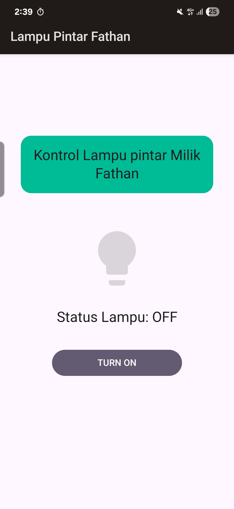
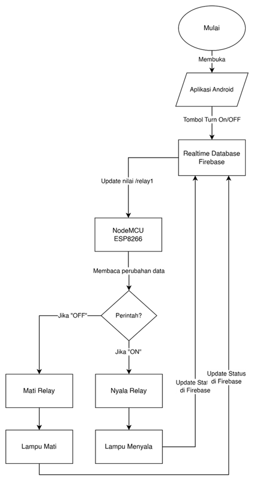
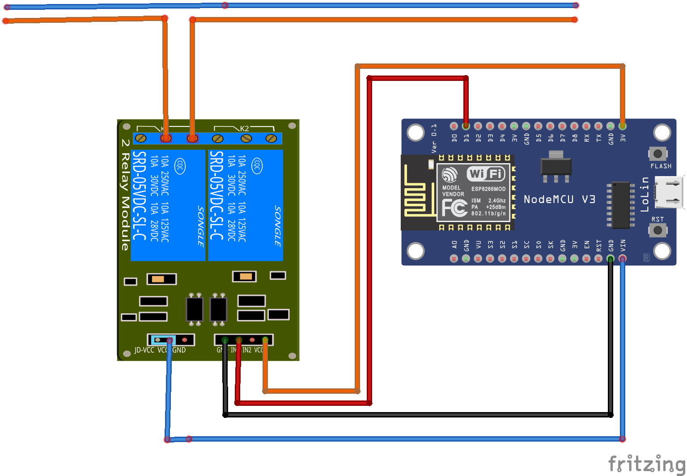
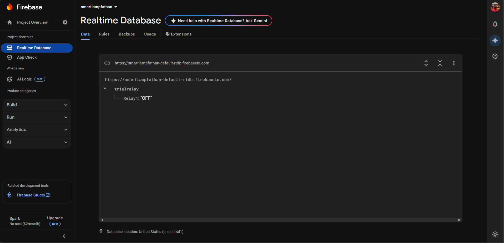

# Smart Lamp IoT with ESP8266, Firebase, and Android

## Deskripsi

Proyek ini merupakan implementasi Internet of Things (IoT) untuk mengontrol lampu secara jarak jauh.
Sistem terdiri dari:

- NodeMCU ESP8266 sebagai mikrokontroler utama yang menghubungkan lampu (via relay) ke internet.
- Firebase Realtime Database sebagai cloud backend untuk komunikasi data antara perangkat dan aplikasi.
- Aplikasi Android (Kotlin) sebagai antarmuka pengguna untuk mengontrol dan memantau status lampu.

Pengguna dapat menyalakan, mematikan, dan memantau status lampu secara real-time melalui aplikasi Android yang terhubung dengan Firebase.

## Features

- Kontrol lampu ON/OFF dari aplikasi Android.
- Sinkronisasi status lampu secara real-time melalui Firebase.
- Mendukung lebih dari satu lampu (multi-relay).
- Koneksi Wi-Fi menggunakan ESP8266.
- Tampilan aplikasi Android sederhana dengan tombol switch.

## Arsitektur Sistem

1. ESP8266
    - Membaca perintah dari Firebase Realtime Database.
    - Mengontrol relay untuk menyalakan/mematikan lampu.
    - Mengupdate status ke Firebase.

2. Firebase Realtime Database
    - Menyimpan status lampu (true/false).
    - Menjadi jembatan komunikasi antara ESP8266 dan aplikasi Android.

3. Android App (Kotlin)
    - UI dengan tombol untuk kontrol ON/OFF.
    - Terhubung ke Firebase menggunakan Firebase SDK.
    - Mengirim perintah dan membaca status secara real-time.

## Instalasi dan Cara Penggunaan
1. NodeMCU ESP8266
    - Hubungkan relay dengan ESP8266 sesuai pin yang dikonfigurasi.
    - Masukkan kode program (Arduino IDE) dengan library Firebase ESP8266 Client (by Mobizt).
    - Isi kredensial Wi-Fi dan Firebase Database URL.
    - Upload kode ke board ESP8266.
  
    

2. Firebase Realtime Database
    - Buat project di Firebase Console
    - Aktifkan Realtime Database dan atur rules menjadi public (atau sesuai kebutuhan keamanan).
    - Catat Database URL dan API key.
  
    

3. Android App (Kotlin)
    - Buka project Android Studio.
    - Hubungkan aplikasi dengan Firebase (Tools > Firebase > Realtime Database).
    - Pastikan google-services.json ada di folder app/.
    - Build dan jalankan aplikasi di emulator/ponsel Android.

4. Jalankan Sistem
    - Nyalakan NodeMCU dan hubungkan ke Wi-Fi.
    - Buka aplikasi Android.
    - Tekan tombol ON/OFF untuk mengontrol lampu.
    - Status lampu akan tersinkron otomatis melalui Firebase.
    
## License
Proyek ini dibuat untuk tujuan penelitian dan pembelajaran.
